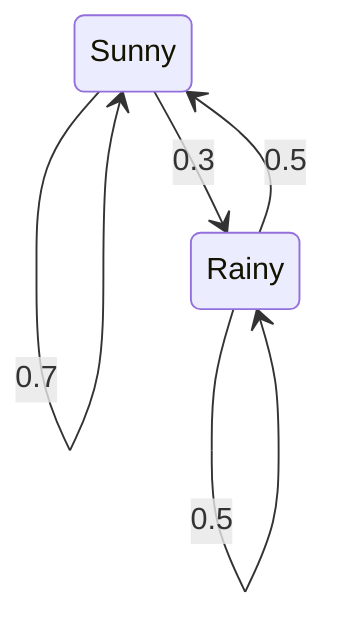
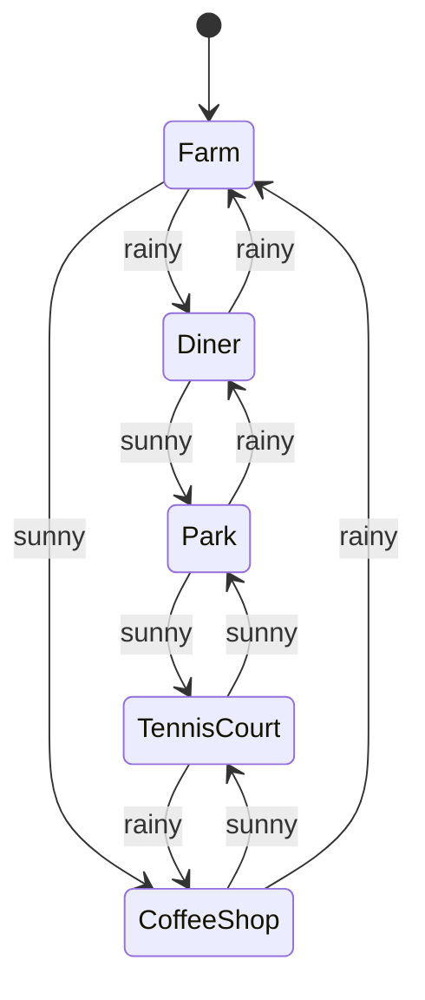
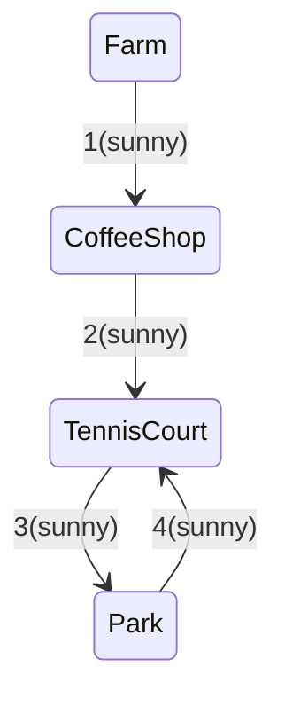

## Problem statement and solution:
From the problem statement we can glean three different points
1.  On a certain day the probability of being sunny or rainy is 0.5, and 0.5 respectively. We can represent it as a vector
			- Weather Probability Vector:
  $$ \begin{array}{c|c} \text{Day} & \\ \hline \text{Sunny} & 0.5 \\ \text{Rainy} & 0.5 \\ \end{array}$$
2. Associated with it, the following information is also given i.e. the weather can change randomly to sunny to rainy on $\textbf{the same day}$ with the following probabilities:
		- $$\begin{array}{ccc}& \text{Sunny} & \text{Rainy} \\\text{Sunny} & 0.7 & 0.3 \\\text{Rainy} & 0.5 & 0.5 \\
\end{array}$$
which can be represented as a statediagram:

The above are the conditional probabilities to get the net probability of remaining sunny or rainy we remove the condition by:
$$
\begin{bmatrix}
           0.5&0.5
         \end{bmatrix}
\times \begin{bmatrix}0.7&0.3\\0.5&0.5\end{bmatrix}=\begin{bmatrix}0.6_{\text{sunny}}&0.4_{\text{rainy}}\end{bmatrix}$$
3. Third piece which is given in the problem statement is the location transition:
	- Location transition
		$$\begin{array}{cccccc} & \text{Farm} & \text{Diner} & \text{Park} & \text{TennisCourt} & \text{CoffeeShop} \\ \text{Farm} & 0 & 1 & 0 & 0 & 1 \\ \text{Diner} & 1 & 0 & 1 & 0 & 0 \\ \text{Park} & 0 & 1 & 0 & 1 & 0 \\ \text{TennisCourt} & 0 & 0 & 1 & 0 & 1 \\ \text{CoffeeShop} & 1 & 0 & 0 & 1 & 0 \\ \end{array}$$
which can be representated as a statediagram like this:
		 




4. Probability of visiting the diner at least (i.e. one or more than once) once can be computed by 
			$$1- \text{probability of not visiting the diner}$$ (In less than 5 moves -- as in the 5th move her grandparents will bring her back to farm.)
Below are all the moves in which she cannot go to diner in 4 moves (it is 4 moves away from the farm and in the 5th move she will go back to farm anyways)



```mermaid
stateDiagram-v2
[*] --> Farm Farm --> CoffeeShop:(sunny) 
CoffeeShop --> Farm:(rainy)
 ```

```mermaid
stateDiagram-v2 
Farm --> CoffeeShop:1(sunny) 
CoffeeShop --> TennisCourt:2(sunny) 
TennisCourt --> CoffeeShop:(rainy) 
CoffeeShop-->Farm:4(rainy)
```
Therefore the probability of visiting the diner atleast once is 
$$ 1-\text{(probability of path1)-(probability of path2)-(probability of path3)}$$
$$1-0.6^4-2\times(0.6^2\times0.4^2)=0.76$$
Thus, there is a $52\%$ chance of ending up in the diner atleast once. Average number of days she's going to be at the diner is $$60\times0.76\approx45\text{days}$$
Going on the same line we can extract the paths for other states and compute the average/expected number of days.

 


